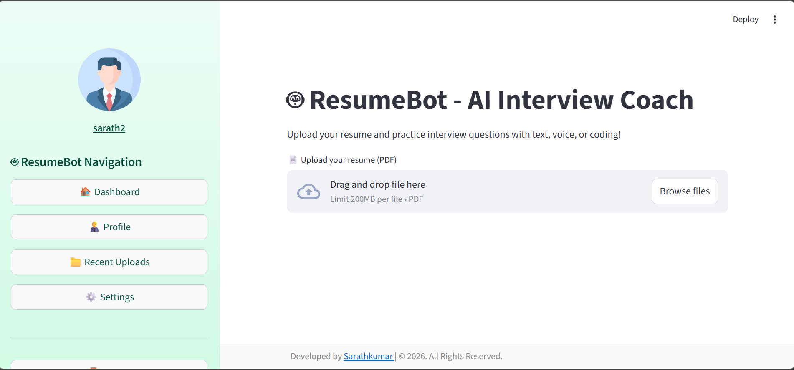

<h1 align="center">🚀 ResumeBot – AI Interview Coach</h1>

  <b>An AI-powered Resume Analysis & Interview Preparation Web Application</b> 
  Built with Python, Streamlit & Generative AI

<h2>📌 About the Project</h2>

ResumeBot – AI Interview Coach is an intelligent web application that helps users 
analyze their resumes and prepare for interviews using AI.

<ul>
  <li>📄 Upload Resume (PDF)</li>
  <li>🤖 AI-generated Interview Questions</li>
  <li>🎤 Voice-based Answer Input</li>
  <li>🧠 AI Feedback Evaluation</li>
  <li>📊 User Dashboard & Profile Management</li>
</ul>

<h2>🖥️ Application Screenshots</h2>

<h3>🔐 Login Page</h3>

  

<h3>📊 Dashboard</h3>

  

<h2>⚙️ Tech Stack</h2>

<ul>
  <li>🐍 Python</li>
  <li>🌐 Streamlit</li>
  <li>🤖 Google Gemini API</li>
  <li>📄 PDF Parsing</li>
  <li>🔐 Authentication System</li>
  <li>🗄️ SQLite Database</li>
  <li>🎤 Speech Recognition</li>
</ul>

<h2>✨ Key Features</h2>

<ul>
  <li>✔ Secure Login & Registration</li>
  <li>✔ Email OTP Verification</li>
  <li>✔ Resume Upload & Parsing</li>
  <li>✔ AI Interview Question Generation</li>
  <li>✔ Voice-Based Answer Input</li>
  <li>✔ AI-Based Performance Feedback</li>
  <li>✔ Dashboard with Profile Management</li>
  <li>✔ Dark / Light Theme Support</li>
</ul>

<h2>📂 Project Structure</h2>

<pre>
Resume_Bot_Ai/
│
├── login.py
├── app.py
├── dashboard.py
├── profile.py
├── settings.py
├── uploads/
├── database.db
└── requirements.txt
</pre>

<h2>🚀 How to Run the Project</h2>

<h3>1️⃣ Clone the Repository</h3>

<pre>
git clone https://github.com/your-username/Resume_Bot_Ai.git
cd Resume_Bot_Ai
</pre>

<h3>2️⃣ Install Dependencies</h3>

<pre>
pip install -r requirements.txt
</pre>

<h3>3️⃣ Run the Application</h3>

<pre>
streamlit run login.py
</pre>

<h2>🎯 Future Enhancements</h2>

<ul>
  <li>🌍 Multi-language Support</li>
  <li>📊 Advanced Performance Analytics</li>
  <li>☁ Cloud Deployment (AWS / Azure)</li>
  <li>📱 Fully Responsive UI</li>
</ul>

<h2 align="center">👨‍💻 Developed By</h2>

<b>Sarathkumar</b> 
Python Full-Stack Developer 
Computational Intelligence Research Foundation, Chennai

⭐ If you like this project, give it a star on GitHub!

